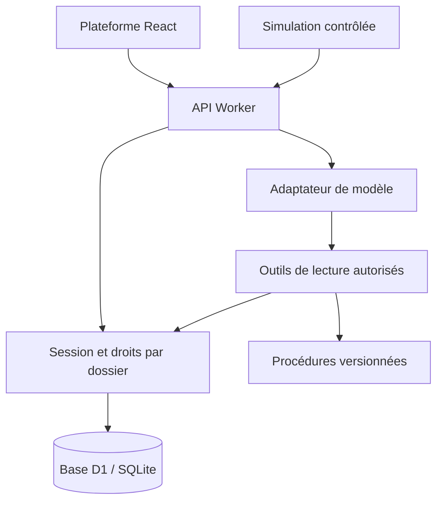

# Architecture

## Responsabilités

`lib/atlas/domain.ts` : types métier, scénarios, transitions, labels, recherche documentaire et masquage partiel. Aucun effet de bord.

`lib/atlas/api.ts` : persistance, sessions, quotas atomiques, API, actions, historique, adaptateur Chat Completions et boucle d’outils. Ce module ne dépend pas de React ou de l’environnement Cloudflare ; l’interface `Database` permet les tests avec SQLite.

`worker/index.ts` : adaptation HTTP et transmission de l’environnement serveur. Les endpoints `/api/` sont gérés avant le routeur de pages.

`db/schema.ts` et `drizzle/` : schéma et migrations. Le runtime ne crée aucune table. Les données synthétiques sont insérées après création de la session.

`app/page.tsx` : sept espaces de navigation, dont une page de contact ; composants UI accessibles du catalogue Shadcn. Toute décision sensible reste côté serveur.

`lib/atlas/contact.ts` : validation et construction d’un lien `mailto:` vers une adresse fixe. Le navigateur n’envoie ni ne stocke le message : le visiteur le relit et confirme l’envoi dans son application mail.

`lib/atlas/support-routing.ts` : politique de résolution avant transfert. Une première demande de contact propose une aide guidée ; une confirmation du client, une opération d’écriture, un sujet sensible ou une information métier manquante ouvre le relais sans nouvelle boucle de rétention. Cette décision est déterministe et testée séparément du LLM.

## Données et cohérence

Clients, produits et achats alimentent les dossiers. Chaque dossier a une version, un état, un historique et une référence unique dans son espace. Les actions métier mettent à jour la version et créent l’événement dans un batch transactionnel. Un identifiant d’opération empêche le rejeu. Un devis bloque la progression automatique tant que le client ne l’a pas accepté.

Les simulations mettent à jour au plus un dossier éligible par cycle ; elles ne génèrent pas un délai de réparation sans donnée explicite. Les estimations affichées sont identifiées comme simulées. La progression automatique est déclenchée par les requêtes, avec une cadence minimale de 20 secondes. Elle n’est ni un flux de transporteur ni un job permanent.

## Modèles et documents

`demo` : réponses déterministes, zéro appel fournisseur. `ollama` : modèle local, boucle HTTP locale exclusivement, aucune clé transmise, raisonnement désactivé par paramètre pour limiter l’attente. `openai` et `compatible` : connecteurs externes conservés mais bloqués par la politique `zero` par défaut. `lib/atlas/model-policy.ts` valide la politique et l’adresse avant tout appel. Seule une configuration administrative `approved`, après un nouvel accord budgétaire, permettrait ces fournisseurs externes. Outils exposés au modèle : `get_case`, `search_knowledge`. Aucun outil de remboursement ou de modification directe n’est exposé au LLM. Le triage et l’escalade humaine restent dans la couche de contrôle locale, y compris lorsqu’un LLM est actif, afin qu’une réponse générée ne puisse ni retenir abusivement le client ni prétendre exécuter une opération indisponible.

Le corpus est statique, fictif, versionné dans le code. La recherche lexicale pondère les mots-clés et les textes. Cette version n’est pas un système hybride/vectoriel. Les historiques de conversation sont conservés par espace et filtrés par dossier avant envoi au modèle. Les changements de documents ou de modèle doivent être évalués avant publication.

## Passage en entreprise

Conserver le contrat des outils, remplacer les adaptateurs de données par les API autorisées de l’entreprise, introduire identité/rôles réels et tests de contrat avec son SI. Voir `PRODUCTION.md` pour le périmètre restant.
